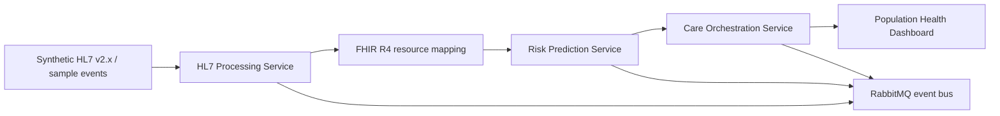

# Architecture

This project is a public challenge/demo implementation of an event-driven HEDIS and clinical quality platform. It demonstrates standards-aware healthcare AI architecture without using PHI, payer production data, or proprietary workflows.

## Services

- HL7 Processing Service: parses HL7-style events and maps them toward FHIR resources.
- Risk Prediction Service: demonstrates XGBoost-style care-gap and non-compliance scoring patterns.
- Care Orchestration Service: creates task and care-plan style workflow outputs.
- Dashboard Service: presents synthetic population-health and quality-management views.

## Boundary

The repository is production-style engineering proof, not a production clinical decision system. A real deployment would require security review, governance, EHR integration validation, clinical oversight, monitoring, and model-risk controls.

